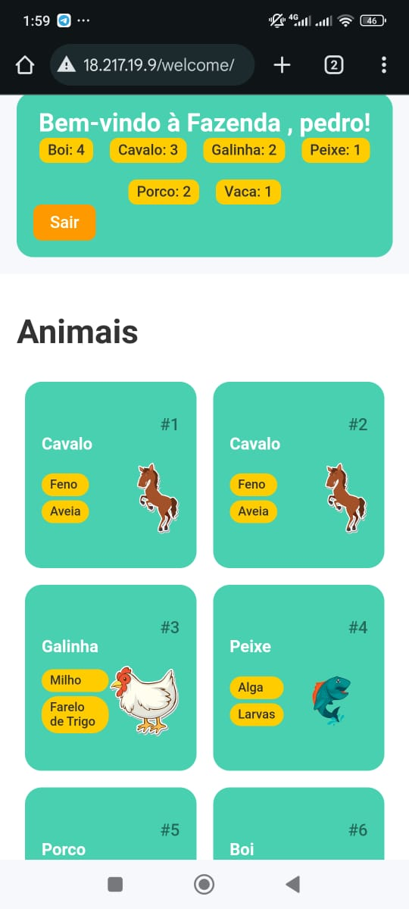

# loginMeDjango

Project using Django to Create a login screen to my animal farm control

## ALGORITHM

TELA DE BACKGROUND AWS
> screen -S nomeDaScreen

ATUALIZAR
> sudo apt update

ATUALIZAR
> sudo apt upgrade

INSTALAR ARQUIVOS NECESSÁRIOS
> sudo apt install git python3 python2-virtualenv

CLONAR REPO
> git clone <https://github.com/Pedrobolfute/loginMeDjango>

ENTRAR NO CORE
> cd loginMeDjango/login

CRIAR AMBIENTE VIRTUAL
> virtualenv venv

ENTRAR NO AMBIENTE VIRTUAL
> source venv/bin/activate

INTALAR DJANGO NO PROJETO
> pip install django

GIT ADD DO DJANGO
> python3 manage.py makemigrations

GIT COMMIT DO DJANGO
> python3 manage.py migrate

===

CONFIG NA AWS

- INSTANCIA > SEGURANÇA > GRUPO SEGURANÇA > EDITAR > TCP; 8000; 0.0.0.0:0

===

REDIRECIONAMENTO DE PORTAS

> sudo /sbin/iptables -t nat -I PREROUTING -p tcp --dport 80 -j REDIRECT --to-port 8000

INICIAR SERVIDOR
> python3 manage.py runserver 0.0.0.0:8000

## To-Do

To not forget...

### Screens

- [x] Screen Login;
- [x] Screen Create Account;
- [x] Screen Change my Account;
- [x] Screen Welcome;
- [x] Screen Admin See EveryOne;

### Function or Methods

>> Screen login, create account, change myAccount:

- [ ] PassEncrypted to server;
- [ ] Little eye to see my password when I click;

>> Screen login and Change my Account:

- [x] Method that confirm if my passwors is right;
- [x] Method that allows me edit my info (password);
- [x] Placeholder brings my name from DB;

>> Screen create account;

- [ ] Password validade if weak, normal or strong;
- [ ] Little bar indicating with color it above;

>> Screen Welcome;

- [ ] Brings welcome "user" with ASCII form;
- [ ] import pyfiglet to do it above;

>> Screen Admin See EveryOne

- [ ] Colums: id, name, password encripted, password normal;

>> Screen change my account

- [x] method that confirm if my user is right
- [x] method that confirm if my password is right
